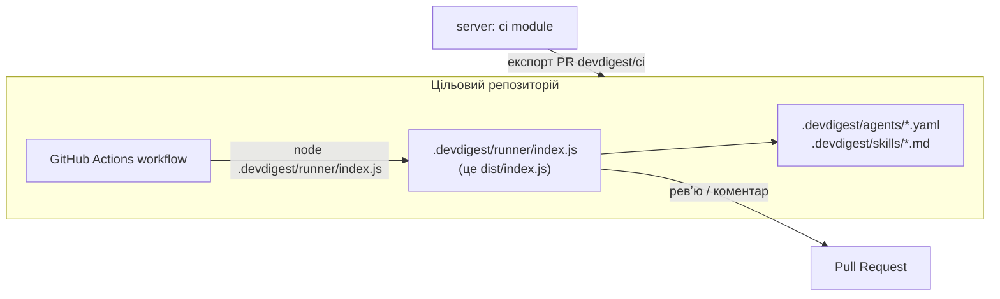

# agent-runner — як це працює

`agent-runner` — це AI-рев'ю PR, яке виконується в GitHub Actions цільового репозиторію, без вашого сервера й Postgres. Воно запускає той самий `reviewer-core`, що й студія.

## Де він живе



`dist/index.js` — це зібраний `agent-runner` (ncc вшив туди `reviewer-core` і `shared`). Сервер кладе його в експортований PR, і Actions запускають його як звичайний скрипт.

## Потік `runCi()` (`agent-runner/src/run.ts`)

```text
main()                                  index.ts: читає env, будує OpenRouterProvider
  runCi
    loadManifest                        .devdigest/agents/*.yaml, валідація AgentManifest
    loadSkillBodies                     .devdigest/skills/<slug>.md → {body, source:'manual'}
    resolvePrContext                    номер PR, title, body, repo з env і event payload
    fetchPrDiff                         GitHub API
    stripIgnoredFiles → parseUnifiedDiff   прибирає .devdigest/** і workflow з диффа
    reviewPullRequest                   reviewer-core: промпт → LLM → groundFindings
    toReviewPayload / countBlockers / gateTriggered
                                        вердикт рахується детерміновано з ci_fail_on
    buildResultArtifact → writeFile     devdigest-result.json (до постингу)
    postGithubReview | postPrComment | нічого     залежно від post_as
    exitCode = gateTriggered ? 1 : 0
  catch → exitCode 1, нічого не постить
```

## Що важливо

- **Ключі з env, а не зі `SecretsProvider`.** `OPENROUTER_API_KEY` і `GITHUB_TOKEN` прямо з `process.env`. У чужому CI іншого каналу немає.
- **Усе ін'єктується.** fs, fetch, LLM і годинник передаються в `runCi` параметрами, тому тести працюють без мережі.
- **Вердикт не від моделі.** Код виходу і вердикт беруться з правил `ci_fail_on`, а не з відповіді LLM. Ґрунтування знахідок (`groundFindings`) обов'язкове.
- **Дифф без власних артефактів.** `.devdigest/**` вирізається з диффа, бо збірка на 1,5 МБ дала б помилку GitHub 422 «diff too large», а рев'ю власного конфігу — це шум.
- **Результат пишеться до постингу.** Якщо GitHub відмовить, вже порахований результат не загубиться.
- **Помилка на будь-якому кроці** дає код 1, без поста й без артефакту.

## Змінні оточення

| Змінна | Призначення |
|---|---|
| `OPENROUTER_API_KEY` | ключ LLM |
| `GITHUB_TOKEN` | читання диффа та постинг |
| `GITHUB_REPOSITORY`, `PR_NUMBER` | який PR рев'юється |
| `DEVDIGEST_DIR` | де лежить `.devdigest/` (за замовчуванням `./.devdigest`) |
| `DEVDIGEST_POST_AS` | `github_review` (за замовчуванням), `pr_comment` або `none` |
| `DEVDIGEST_RESULT_PATH` | куди писати `devdigest-result.json` |
