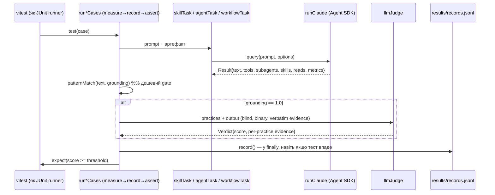
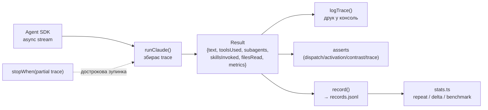
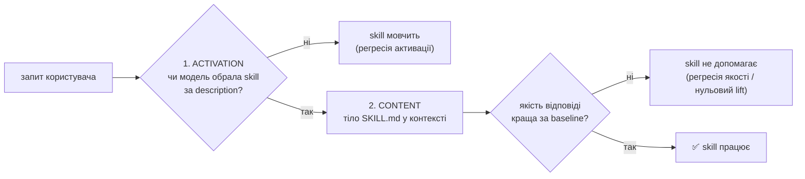
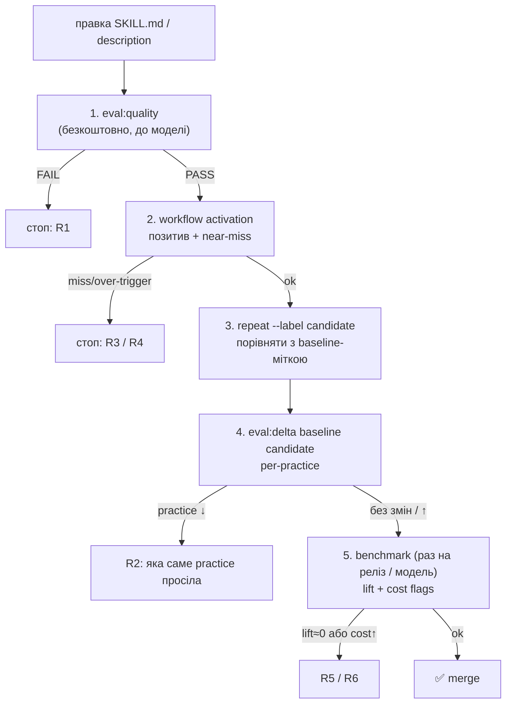

# Harness evals у dev-digest — як це працює

Документ для тих, хто не пише на Node.js. Фокус: **ідея** (що і як міряємо), **звідки беруться
тестові дані**, **коли запускати**, **як прокидаються traces** і **як виявляти регресію**.
Для коду є аналогії з Java (JUnit) та Python (pytest), де в репо зараз TypeScript.

> Деталі й повний список команд — в [`evals/README.md`](evals/README.md).
> Документ описує лише пакет `evals/`: він тестує **наш Claude Code harness** — skills
> (`.claude/skills`), subagents (`.claude/agents`) і `CLAUDE.md` — а не product-агентів DevDigest.

## Зміст

1. [Спільна основа](#1-спільна-основа) — ідея, рівні, пайплайн кейса, traces, записи
2. [Частина I — Тестування агента (subagent)](#частина-i--тестування-агента-subagent)
3. [Частина II — Тестування skill](#частина-ii--тестування-skill) — включно зі **стратегією виявлення регресії**
4. [Спільне: запуск, CI, змінні, безпека](#4-спільне-запуск-ci-змінні-безпека)
5. [Java / Python відповідники](#5-java--python-відповідники)

---

## 1. Спільна основа

### 1.1. Ідея

LLM недетермінований, тому `assertEquals` не працює. Замість "вивід == очікуване" міряємо
**властивості**:

1. **Що модель реально зробила** (tools, subagents, skills, прочитані файли) — це **trace**,
   перевіряється кодом детерміновано.
2. **Чи є в тексті конкретні докази** — `patternMatch`, дешево, без моделі.
3. **Чи виконані "практики"** — другий LLM ("суддя") ставить PASS/FAIL по кожному пункту, але
   PASS лише з дослівною цитатою-доказом.
4. **Скільки це дає порівняно з "без артефакту"** — benchmark: з артефактом vs без → *lift*.

Тобто `pytest` + `assertj`, де "обʼєкт під тестом" — промпт, а замість `assertEquals` —
метрики з порогом (`threshold`).

### 1.2. Три рівні (tiers) і хто що тестує

```text
evals/
├── (static gate)  pnpm eval:quality     без моделі: структура SKILL.md, frontmatter, лінки   ← skill
├── skills/        content tier          skill вшивається в system prompt → LLM-суддя          ← skill
├── agents/        tool tier             subagent + його tools → LLM-суддя                     ← agent
└── workflow/      systemic tier         реальний harness → перевірка TRACE                    ← обидва
```

| Tier | Питання | Як ізолюємо | Чим оцінюємо |
|---|---|---|---|
| **static** | Чи SKILL.md взагалі валідний? | модель не потрібна | правила коду |
| **skills** | Чи *зміст* skill покращує відповідь? | `skillTask`: контент → `systemPrompt`, **нічого з диска**, tools немає | `patternMatch` → `llmJudge` |
| **agents** | Чи *зміст* агента працює з його tools? | `agentTask`: контент → `systemPrompt` + `allowedTools` з frontmatter | `patternMatch` → `llmJudge` |
| **workflow** | Чи артефакт **спрацьовує в реальному харнесі**? | `workflowTask`: `settingSources: ["project"]` | **тільки trace**, без судді |

Content-eval не бачить системних ефектів: якщо skill ніколи не активується в житті, його ідеальний
зміст нічого не вартий. Тому для кожного артефакту потрібні **обидва** виміри: *"чи хороший
зміст"* (skills/agents) і *"чи його взагалі викликають"* (workflow).

### 1.3. Потік одного кейсу



**measure → record → assert**: `record()` стоїть у `finally`, а `expect` — строго після. Навіть
**провалений** запуск лишає запис, інакше статистика мовчки "забуває" невдачі. Автор кейсу цей
цикл не пише — ним володіє `run*Cases`. (Java: `try { run } finally { listener.record() }` і
`assertThat` після; pytest: фікстура з `yield` або `pytest_runtest_makereport`.)

### 1.4. Два скорери

- `patternMatch(output, expected)` — детерміноване покриття підрядків, без моделі. Якщо в кейса є
  `grounding`, він іде першим і мусить дорівнювати `1.0`, інакше суддя **не викликається**.
- `llmJudge(output, practices)` — один запит, строгий JSON, бінарний PASS/FAIL по кожній practice,
  PASS лише з **дослівною** цитатою. Суддя за замовчуванням — сильніша модель (`claude-sonnet-5`),
  ніж та, що тестується (`claude-haiku-4-5`). Реальні запобіжники від упередженості:
  **blind + binary + verbatim evidence**.

### 1.5. Traces — як вони "прокидуються"

**Не плутати з distributed tracing (OpenTelemetry/Zipkin/Sleuth).** Trace — це **підсумок того,
що агентна сесія реально зробила**, зібраний із потоку повідомлень SDK. Жодних trace-id між
сервісами. "Прокидування" — це проходження одного обʼєкта `Result` через шари.

`evals/src/runtime/run-claude.ts` → `runClaude()`. SDK віддає **async-ітератор** повідомлень
(`for await (const msg of query(...))`). Для кожного `tool_use`-блоку:

```text
tools.push(block.name)                                # будь-який tool
якщо name ∈ {Task, Agent}  → subagents.push(input.subagent_type)
якщо name == "Read"        → reads.push(input.file_path)
якщо name == "Skill"       → skills.push(input.skill)
якщо stopWhen(partialTrace) → зупинити сесію достроково
на "result": num_turns, duration_ms, tokens
```

Перевіряємо **дії**, а не те, що модель *написала*: вона може сказати "я запустила архітектора",
не запускаючи його. Trace не бреше.



- **Early stop (`stopWhen`)** — щойно докази є (subagent запущено), сесію переривають: економія
  токенів і часу. (Python: `return` із циклу `async for`; Java: `takeWhile`.)
- **Trace зберігається у записі**: `trace: {tools, subagents, skills, reads}` в кожному рядку
  `records.jsonl` поруч із git SHA, `dirty`-прапором і метриками.
- **Activation** = явний виклик `Skill` **або** читання `skills/<name>/SKILL.md`
  (`activated()` у `dsl/case.ts`).

### 1.6. Записи та статистика

Кожен кейс → рядок у `evals/results/records.jsonl` (gitignored, **append-only**, видаляти безпечно):

```jsonc
{ "run_id": "...", "git_sha": "...", "dirty": false, "config": "candidate",
  "outcome": true, "score": 0.8, "threshold": 0.6,
  "practices": [ { "practice": "...", "passed": true, "evidence": "verbatim quote" } ],
  "trace": { "tools": [], "subagents": [], "skills": [], "reads": [] },
  "metrics": { "durationMs": 0, "inputTokens": 0, "outputTokens": 0, "toolCallCount": 0 } }
```

Повний вивід моделі — у `results/outputs/<run_id>/<slug>.md`. Sample stddev (n−1); при n<5
інструменти самі кажуть "лише орієнтовно". **Practice = її текст**: переформулювали practice —
почалась нова серія статистики (свідомо).

Прапорці аналітика (benchmark):

| Flag | Значення |
|---|---|
| `non_discriminating` | practice 100% і з артефактом, і без → нічого не міряє |
| `always_failing` | 0% в обох |
| `flaky` | pass rate строго 20–80% |
| `cost_regression` | candidate витрачає > 125% токенів baseline |
| `missing_data` | конфіг без записів |

---

## Частина I — Тестування агента (subagent)

**Що таке агент тут:** файл `.claude/agents/<name>.md` — system prompt + список `tools`. Він
**сам** ходить по репо (Read/Grep/Glob) і видає структурований звіт. Приклад: `architecture-reviewer`.

### I.1. Що перевіряємо

| Вимір | Tier | Питання |
|---|---|---|
| Якість звіту | `agents/` | Знаходить заплановані порушення? Не вигадує зайвих? Дотримується формату? |
| Диспатч | `workflow/` (`dispatch`/`trace`) | Чи головна сесія *справді запускає* цього субагента за запитом? |

Чому агент запускають **з tools**: він за дизайном "читає доки, грепає імпорти". Без tools він
відмовляється або знижує всі знахідки до `cannot-verify`. Тому `agentTask` дає йому рівно ті tools,
що в frontmatter, і cwd = корінь репо — так само, як у production. Baseline теж отримує ці tools
(інакше lift був би нечесним).

### I.2. Звідки тестові дані

Вручну, поруч із тестом:

```text
evals/agents/architecture-reviewer/
├── architecture-reviewer.eval.ts    # ТОНКИЙ: describeAgent(...) + runAgentCases(...)
├── architecture-reviewer.cases.ts   # ДАНІ: prompt, practices, threshold, maxTurns, timeoutMs
└── fixtures/
    ├── checkout-service.diff        # diff з двома навмисними порушеннями
    ├── reviewer-core-gate.diff      # порушення в доменному ядрі
    └── benign-refactor.diff         # НЕГАТИВНИЙ КОНТРОЛЬ: порушень немає
```

Це **golden set**: для кожного diff ми *знаємо* правильну відповідь. Обовʼязкова складова —
негативні fixture-и (`benign-refactor`), що ловлять агента, який **вигадує** зауваження.

Типові `practices` для агента (формат звіту — теж частина контракту):

```ts
practices: [
  "flags the domain file importing 'fastify' as a violation of the inward-only dependency rule",
  "flags `new PgCheckoutRepository()` inside service.ts as a DI-discipline violation",
  "fills the 'Rule violated' column for EVERY finding",
  "quotes the offending line verbatim as evidence, not a paraphrase",
  "closes the table with `Summary: N finding(s)` matching the row count",
],
threshold: 1.0,           // для агента з чітким контрактом — усі practices
maxTurns: 25, timeoutMs: 420_000,   // агентні сесії довгі, особливо на дешевих моделях
```

Окремі кейси на **"не вигадуй"**: `does not fabricate a boundary violation for a benign rename`,
`stays scoped to structural findings, no style/naming comments`.

### I.3. Workflow-кейси для агента

```ts
{ kind: "trace",
  name: "architecture review request dispatches the architecture-reviewer subagent",
  // Ендпоінт НЕ існує — інакше модель рецензує наявний код сама, а не диспатчить
  prompt: "Я планую додати НОВИЙ ендпоінт GET /reviews/:id/export ... ОБОВʼЯЗКОВО запусти сабагента architecture-reviewer ...",
  expectSubagents: ["architecture-reviewer"], maxTurns: 8 }
```

Асертить `trace.subagents`, не текст. Сесія зупиняється одразу, як тільки субагента запущено
(`stopWhen`), не чекаючи завершення важкого вкладеного агента.

### I.4. Регресія агента

| Що зламалось | Де проявиться | Сигнал |
|---|---|---|
| Агент перестав знаходити порушення | `agents/`: practice "flags …" | pass rate конкретної practice падає |
| Агент почав шуміти | кейс на benign-diff | practice "no boundary violations" падає |
| Змінився формат звіту | practices про таблицю / `Summary: N` | падають форматні practices |
| Агента більше не диспатчать | `workflow`: `trace`/`dispatch` | `subagents` порожній |
| Зміна формулювання агента | **A/B-пара** | див. нижче |

**A/B-пара агентів** — готовий патерн регресійного тесту промпту. `architecture-reviewer-lite` —
копія агента з прибраним жорстким правилом "cite the documented rule". Її `.eval.ts` **реюзає
cases** строгого варіанта (той самий fixture, ті самі practices, той самий поріг), міняється
тільки артефакт. Потім `eval:repeat` для обох з мітками і `eval:delta` — видно, яка саме practice
просіла.

---

## Частина II — Тестування skill

**Що таке skill тут:** папка `.claude/skills/<name>/` з `SKILL.md` (frontmatter `name` +
`description` + тіло) і `references/*.md`. На відміну від агента, skill — це **знання/процедура**,
яку модель підвантажує *в свій контекст*, коли вирішить, що `description` підходить. Звідси
**дві різні точки відмови**:



Тому для skill потрібно **чотири шари** перевірок — від найдешевшого до найдорожчого.

### II.1. Чотири шари тестування skill

| # | Шар | Команда | Модель? | Ловить |
|---|---|---|---|---|
| 1 | **Static** | `pnpm eval:quality [skill]` | ні | зламаний frontmatter, `name` ≠ папка, биті лінки на `references/`, порожнє тіло (<100 символів), <2 заголовків; warn: нема eval-файлу, >500 рядків |
| 2 | **Content** (`skills/`) | `pnpm vitest run skills/<name>` | так + суддя | зміст SKILL.md перестав давати потрібну відповідь |
| 3 | **Activation** (`workflow/`) | `pnpm eval:workflow` | так, без судді | `description` не тригерить / тригерить даремно |
| 4 | **Lift** (benchmark) | `pnpm eval:benchmark skills/<name>` | так | skill нічого не додає порівняно з "голою" моделлю |

### II.2. Звідки тестові дані для skill

**Content-кейси** (`evals/skills/<name>/`) — така ж структура, як у агента (`.eval.ts` +
`.cases.ts` + `fixtures/`). Особливість: skill тут працює **без tools**, тому дані, які він
зазвичай збирав би сам через Read/Bash, **вклеюють у prompt** як синтетичний датасет
(`dependency-checker.cases.ts` вклеює вигадані `package.json`, розміри `node_modules`, результати
grep). Цим міряється саме *зміст* SKILL.md.

```ts
{ name: "full report follows the required 5-section structure with a Mermaid graph",
  kind: "quality",
  prompt: `Run a dependency check on this repo...\n\n${REPO_DATA}`,
  grounding: ["```mermaid", "flowchart"],   // дешевий gate: без діаграми суддю не кличемо
  practices: [ "the report has a 'Scope' section...", "includes a Mermaid flowchart...",
               "every finding names a specific package, not generic advice" ],
  threshold: 0.7 }
```

**Activation-кейси** (`evals/workflow/review-workflow.cases.ts`) — парами:

```ts
{ kind: "activation", skill: "engineering-insights", shouldActivate: true,
  prompt: "Щойно з'ясував, чому pgvector-запит повертав нуль рядків ... Хочу це зафіксувати" },
{ kind: "activation", skill: "engineering-insights", shouldActivate: false,   // near-miss
  prompt: "Поясни, як працюють розмірності pgvector ..." }                    // та сама тема, інша інтенція
```

Негативний near-miss ловить **over-triggering**: якщо `description` розширили надто широко,
skill почне вмикатись на питання, що його не стосуються.

**Еталонний формат "знахідок"** (для skill-ів типу reviewer, напр. `onion-architecture`) —
конвенція `skill-evals/_shared/README.md`: eval їде *разом зі skill-ом* у
`.claude/skills/<skill>/evals/`:

```text
.claude/skills/onion-architecture/evals/
├── eval.md                    # task-промпти + критерії + пороги
├── expected-findings.json     # еталон: file / line(±3) / rule / must_mention
└── fixtures/<case>/...        # код БЕЗ коментарів-підказок
```

Правила: у fixture нема жодних підказок про порушення (коментарі, назви, `TODO`); у кожному
наборі є **чисті файли-приманки** (`must_not_flag`) — міряються і **recall**, і **хибні
спрацювання**; промпти **не згадують** назву skill/методології (напр. "onion"), щоб skill мав
спрацювати за описом. Поріг для `onion-architecture`: recall ≥ 0.85 (з 15 знахідок можна
пропустити 2) **і** жодного `must_not_flag` у порушеннях.
> ⚠️ Автоматичного раннера для цього формату ще немає (позначено TODO в `_shared/README.md`):
> зараз його проганяють вручну — по два субагенти на кейс, зі skill-ом і без.

### II.3. Стратегія виявлення регресії skill

#### Що вважаємо регресією

| Тип | Приклад | Як проявляється |
|---|---|---|
| **R1. Структурна** | зламано посилання на `references/x.md`, `name` не збігається з папкою | `eval:quality` → FAIL |
| **R2. Якості (content)** | правка SKILL.md прибрала правило → у звіті зникла секція/знахідка | **конкретна practice** падає з ~100% до <100% |
| **R3. Активації (під)** | переписали `description` → skill не вмикається на очікуваний запит | `activation` `shouldActivate:true` → miss |
| **R4. Активації (над)** | `description` став широким → вмикається на "питання по темі" | `activation` near-miss `false` → хибний hit |
| **R5. Lift** | нова модель і так робить це без skill → артефакт марний; або правка збила перевагу | `pass_rate` candidate ≈ baseline, `non_discriminating` |
| **R6. Вартість** | skill роздувся → відповіді довші/дорожчі | `cost_regression` (>125% токенів baseline), ріст `tokens_out` / `turns` |
| **R7. Дрейф середовища** | змінилась модель / версія Claude Code, SKILL.md той самий | падіння без diff у skill; `git_sha` у records той самий |

#### Принцип: регресія — це різниця на рівні **practice**, а не одне червоне "FAIL"

Одиночний прогін LLM недетермінований: у `flaky`-зоні (20–80%) падіння одного прогону — це шум.
Тому порівнюємо **серії**, а в серії дивимось на найдрібнішу одиницю — practice.



#### Золоте правило — baseline знімають ДО правки

```bash
cd evals
pnpm eval:repeat skills/onion-architecture -n 2 --label baseline    # ← ДО редагування SKILL.md
# ... правимо .claude/skills/onion-architecture/SKILL.md ...
pnpm eval:repeat skills/onion-architecture -n 2 --label candidate   # ← ПІСЛЯ
pnpm eval:delta baseline candidate
```

`delta` показує три рівні: pass rate тесту → **кожна practice (головний сигнал)** → метрики
(`turns`, `duration_ms`, `tokens_out`, `baseline → candidate (±diff)`). Зелене — краще, червоне —
гірше, тьмяне — без змін. Practice лише з одного боку відображається як `— → X%`.
Відновити baseline постфактум неможливо — тільки відкотити правку.

#### Правила рішення (рекомендована політика)

> Інструменти **показують** різницю, але **автоматичного "гейта на падіння"** немає — рішення
> приймає людина (або ви додаєте його в CI). Нижче — рекомендована інтерпретація.

| Спостереження в `delta` / `benchmark` | Висновок |
|---|---|
| practice була 100% → стала <100%, **і** падіння повторюється в обох прогонах | **реальна регресія R2**, шукайте правку, що зачепила цю практику |
| падіння в одному з двох прогонів, practice у зоні 20–80% (`flaky`) | **шум**; збільшити `EVAL_MAX_RUNS=5`, не відкидати правку одразу |
| `non_discriminating` (100% і з skill, і без) | практика нічого не міряє — **посилити завдання**, а не звинувачувати baseline |
| `always_failing` в обох конфігах | практика/завдання нереальні або занадто суворі — переписати |
| `shouldActivate:true` більше не активується | **R3**: `description` втратив тригерні слова; відкотити або додати use-cases у description |
| near-miss `false` раптом активується | **R4**: звузити `description` |
| `pass_rate` candidate − baseline → ≈0 | **R5**: skill нічого не додає на цьому завданні (або завдання підказане fixture-ом) |
| `cost_regression` | **R6**: SKILL.md/references надто роздуті; винести в `references/` з умовним читанням |
| червоне без змін у skill, `git_sha` той самий | **R7**: дрейф моделі/CLI; перезняти baseline на новій моделі |

#### Що саме в записах дозволяє знайти причину

Кожен рядок `records.jsonl` має `git_sha` + `dirty` + `config` + `practices[].evidence` (цитата, на
якій суддя заснував PASS/FAIL). Тож можна порівняти **який саме фрагмент відповіді** був
доказом до правки і чого не стало після, а `results/outputs/<run>/<slug>.md` — перечитати повний
текст і за потреби повторно прогнати суддю.

#### Мінімальний чекліст регресії skill

1. `pnpm eval:quality <skill>` — завжди, безкоштовно.
2. Є й позитивний, **й near-miss** activation-кейс (інакше R3/R4 невидимі).
3. У `cases.ts` є кейс з **чистим вводом** (негативний контроль) — інакше шум не помітите.
4. Для кожної практики з порогом: є fixture, що **гарантовано** її перевіряє (не підказаний у prompt).
5. `repeat --label baseline` знято **до** правки; після — `candidate` + `delta`.
6. Перед релізом / зміною моделі — `benchmark` (lift + cost).
7. Для CI — `ci-detect.mjs` мапить `.claude/skills/<n>/**` на `evals/skills/<n>`; skill **без**
   evals не падає, а друкує `SKILL (no evals)` — це видимий борг, не тихий пропуск.

---

## 4. Спільне: запуск, CI, змінні, безпека

### 4.1. Коли що запускати

| Ви змінили… | Запустіть |
|---|---|
| структуру `SKILL.md` | `pnpm eval:quality` |
| зміст skill | `pnpm vitest run skills/<name>` |
| `description` skill / `CLAUDE.md` / dispatch | `pnpm eval:workflow` |
| subagent-файл | `pnpm vitest run agents/<name>` |
| хочете **виміряти** зміну | `eval:repeat --label baseline` → правка → `--label candidate` → `eval:delta baseline candidate` |
| новий артефакт: чи вартий токенів? | `pnpm eval:benchmark skills/<name>` (або `agents/<name>`) |
| модель / версія Claude Code | `pnpm eval` (вся suite) |
| математику статистики | `pnpm vitest run src/records/stats.test.ts` |
| хочу додати evals для нового артефакту | `pnpm eval:scaffold <skill>` / `--agent <name>` |

Усі команди — з `cd evals`. `eval:compare` показує run-flip історію (`history.jsonl`).

**Benchmark** запускає *той самий* кейс з артефактом (**candidate**) і без нього
(**baseline**, `EVAL_CONFIG=baseline`). Змінюється рівно одна змінна; prompt і fixture —
ідентичні (інакше Δ не можна приписати артефакту). Тільки для skills/agents — не для `workflow/`
(там своя схема control vs treatment). Ліміт `repeat`/`benchmark` — **2** прогони (кожен — реальна
LLM-сесія); підняти: `EVAL_MAX_RUNS=5`.

### 4.2. CI

`.github/workflows/evals.yml` + `evals/scripts/ci-detect.mjs`:

```text
.claude/skills/<n>/**      → evals/skills/<n>
.claude/agents/<n>.md      → evals/agents/<n> + workflow tier
будь-який CLAUDE.md        → workflow tier
```

Блокують PR лише `detect` і `static` (без моделі). Model-jobs — `continue-on-error`, бо активація
недетермінована. Моделі — через OpenRouter; для tool-tier не-Anthropic моделей потрібен LiteLLM-
проксі (`evals/proxy/`), що перекладає Anthropic wire-протокол в OpenAI-формат.

### 4.3. Змінні оточення

| Env var | Default | Значення |
|---|---|---|
| `EVAL_BACKEND` | `subscription` | `subscription` (Claude Code login) або `openrouter` |
| `EVAL_MODEL` | `claude-haiku-4-5` | модель під тестом (для openrouter — slug, напр. `google/gemini-2.5-flash`) |
| `EVAL_JUDGE_MODEL` | `claude-sonnet-5` | суддя |
| `EVAL_MAX_TURNS` | `8` | макс. ходів на кейс |
| `EVAL_MAX_RUNS` | `2` | ліміт прогонів для repeat/benchmark |
| `EVAL_CONFIG` | `candidate` | `baseline` вимикає ін'єкцію артефакту (ставить benchmark) |
| `OPENROUTER_API_KEY` | — | обовʼязково для `openrouter` |
| `OPENROUTER_BASE_URL` | OpenRouter | вказати на LiteLLM-проксі (`http://localhost:4000`) |

### 4.4. Безпека й підводні камені

- Сесії йдуть з `permissionMode: "bypassPermissions"`, тому `workflowTask` має **read-only**
  allow-list (`Read, Grep, Glob, Task, Agent, Skill`). Не копіюйте bypass туди, де є `Write/Bash`.
  Локально workflow-tier краще гнати на throwaway-клоні.
- Дешеві не-Anthropic моделі (напр. DeepSeek) можуть виконати роботу **inline** замість dispatch.
  За README, `google/gemini-2.5-flash` диспатчить.
- `activation`-кейси поведінково чутливі: на не-Anthropic моделях вважати **індикативними**
  (модель може виконати дію напряму, не викликавши `Skill`).
- Rate-limit OpenRouter деградує сесії до одного ходу: tool-tier запускати послідовно.
- Низький lift зазвичай означає, що fixture вже містить відповідь — міняти треба **завдання**,
  а не baseline: подавайте "сирий" вхід (симптом без діагнозу).

---

## 5. Java / Python відповідники

| В репо (TS) | Java | Python |
|---|---|---|
| `vitest` (`describe`/`test`) | JUnit 5 (`@Nested`, `@Test`, `@ParameterizedTest`) | `pytest` (`parametrize`) |
| `*.cases.ts` (масив обʼєктів) | `@MethodSource` / `record`-и | `parametrize` + `dataclass` |
| `fixtures/*.diff` | `src/test/resources` | `tests/fixtures/` |
| `for await (msg of query())` | `Flow.Publisher` / `Stream` | `async for msg in query()` |
| `results/records.jsonl` | JSON Lines + Jackson | `json.dumps` по рядку |
| vitest `reporter` (`trend-reporter.ts`) | `TestExecutionListener` | `pytest_runtest_logreport` |
| `eval:delta` (порівняння двох серій) | власний compare поверх JSONL | `pandas.groupby('practice')` |

### 5.1. Збір trace — Python

Імена класів SDK наведено орієнтовно: звіряйте з документацією `claude-agent-sdk`.

```python
from dataclasses import dataclass, field
from claude_agent_sdk import query, ClaudeAgentOptions, AssistantMessage, ToolUseBlock

@dataclass
class Trace:
    tools: set[str] = field(default_factory=set)
    subagents: set[str] = field(default_factory=set)
    skills: set[str] = field(default_factory=set)
    reads: list[str] = field(default_factory=list)

async def run_claude(prompt: str, stop_when=lambda t: False) -> Trace:
    t = Trace()
    opts = ClaudeAgentOptions(
        allowed_tools=["Read", "Grep", "Glob", "Task", "Skill"],  # read-only allow-list
        setting_sources=["project"],                             # реальний CLAUDE.md
    )
    async for msg in query(prompt=prompt, options=opts):
        if isinstance(msg, AssistantMessage):
            for b in msg.content:
                if isinstance(b, ToolUseBlock):
                    t.tools.add(b.name)
                    if b.name in ("Task", "Agent"):
                        t.subagents.add(b.input.get("subagent_type", ""))
                    if b.name == "Read":
                        t.reads.append(b.input.get("file_path", ""))
                    if b.name == "Skill":
                        t.skills.add(b.input.get("skill", ""))
                    if stop_when(t):          # early stop — доказ уже є
                        return t
    return t

# агент: dispatch
async def test_dispatches_architecture_reviewer():
    trace = await run_claude("... ОБОВʼЯЗКОВО запусти architecture-reviewer ...")
    assert "architecture-reviewer" in trace.subagents

# skill: activation, позитив + near-miss
@pytest.mark.parametrize("prompt,should", [
    ("Щойно з'ясував, чому pgvector повертав 0 рядків... зафіксувати", True),
    ("Поясни, як працюють розмірності pgvector", False),      # near-miss
])
async def test_skill_activation(prompt, should):
    trace = await run_claude(prompt)
    activated = "engineering-insights" in trace.skills or any(
        "skills/engineering-insights/SKILL.md" in p for p in trace.reads)
    assert activated == should
```

### 5.2. Те саме на Java (форма даних і тестів)

```java
record Trace(Set<String> tools, Set<String> subagents, Set<String> skills, List<String> reads) {
    boolean activated(String skill) {
        return skills.contains(skill)
            || reads.stream().anyMatch(p -> p.contains("skills/" + skill + "/SKILL.md"));
    }
}

@ParameterizedTest
@CsvSource({ "'Щойно з'ясував, чому ... зафіксувати', true",
             "'Поясни, як працюють розмірності pgvector', false" })   // near-miss
void skillActivation(String prompt, boolean should) {
    assertThat(runner.run(prompt, Settings.PROJECT).activated("engineering-insights"))
        .isEqualTo(should);
}

@Test
void claudeMdChangesWhatIsRead() {            // contrast: treatment vs control
    var treatment = runner.run(PROMPT, Settings.PROJECT);
    var control   = runner.run(PROMPT, Settings.NONE, emptyTmpDir());
    assertThat(treatment.reads()).anyMatch(p -> p.endsWith("api-contracts.md"));
    assertThat(control.reads()).noneMatch(p -> p.endsWith("api-contracts.md"));
}
```

### 5.3. Виявлення регресії на практиці — Python (аналог `eval:delta`)

```python
import json, collections, statistics

def load(label):   # records.jsonl → {practice: [passed, passed, ...]}
    series = collections.defaultdict(list)
    for line in open("results/records.jsonl"):
        r = json.loads(line)
        if r.get("label") == label:
            for p in r["practices"]:
                series[p["practice"]].append(p["passed"])
    return series

base, cand = load("baseline"), load("candidate")
for practice in sorted(set(base) | set(cand)):
    b = sum(base[practice]) / len(base[practice]) if base[practice] else None
    c = sum(cand[practice]) / len(cand[practice]) if cand[practice] else None
    flaky = c is not None and 0.2 < c < 0.8
    regressed = b is not None and c is not None and c < b
    print(f"{'REGRESSION' if regressed and not flaky else 'flaky?' if flaky else 'ok':<11}"
          f"{b!s:>6} → {c!s:<6} {practice[:70]}")
```

### 5.4. Мінімальний склад, якщо будувати з нуля

```text
evals/
├── cases/            # YAML/JSON: prompt, practices, threshold, шляхи fixture
├── fixtures/         # .diff / код без підказок + чисті приманки
├── runner/           # run_claude → Trace (async-ітерація SDK-потоку)
├── scoring/          # pattern_match, llm_judge (blind+binary+verbatim)
├── records.jsonl     # append-only; запис у finally, ДО asserts
├── compare.py        # delta по practice між двома мітками
└── test_*.py / *Test.java   # тонкі: load cases → run → assert
```

Три речі, які варто перенести **без змін**:
1. trace збирається з **дій**, а не з тексту;
2. `record` у `finally` — провали теж лишають слід;
3. A/B із **однією** змінною (artifact on/off; CLAUDE.md on/off), решта константна.
