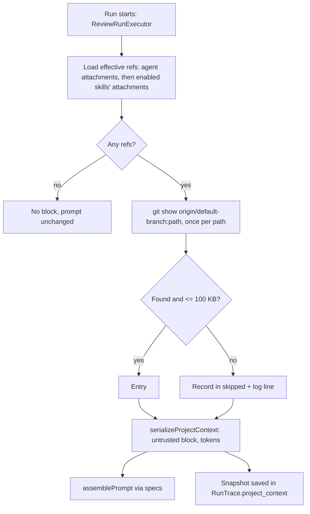

# Design note: Project Context

Reference write-up of what was built for SPEC-01
([`project-context.md`](project-context.md)). Source plan:
[`docs/plans/project-context.md`](../plans/project-context.md). Implemented
on branch `hw-5`; not yet committed when this note was written, so there is
no commit to link. Mockups: `docs/design/project-context-*.png`. Glossary
terms (Context Document, Attachment, Project context block) live in
`CONTEXT.md`.

## What it is and why

A review agent only saw the diff, the PR description, the repo map, and its
skills. Teams already keep specs, design docs, and hard-won notes in the
repo; nothing let an agent read them. Project Context lets a user pick
Markdown files from `.devdigest/{specs,docs,insights}/` of a repo, attach
them (ordered) to Agents and Skills, and have the effective set injected
into every run as an untrusted `## Project context` block.

## Mechanism

**Documents are files.** A server adapter (`server/src/adapters/context-docs/`,
wired as `container.contextDocs`) lists/reads/writes/deletes `.md` files
inside the clone, confined to the three folders. The `context` module
(`server/src/modules/context/`) exposes routes under
`/repos/:repoId/context/`; only the attachment link lives in Postgres
(`context_attachments`, migration `0014`).

**Effective set.** The agent's own attachments in `order`, then each linked
enabled skill's attachments in `agent_skills.order`, deduplicated by path,
first occurrence wins (`dedupeEffectiveSet`). "Enabled skill" means globally
enabled and linked via `agent_skills`; no per-link enabled column exists.

**Serialization is pure.** `reviewer-core/src/project-context/` contains
`serializeProjectContext`, `dedupeEffectiveSet`, and
`estimateTokens = ceil(chars / 4)`. Each document becomes
`Path: <path>` plus content (`(empty document)` for empty files), is wrapped
with the existing `wrapUntrusted` (`spec-<i>` label), and is placed under the
`## Project context` heading. Output is byte-identical for identical input.
Empty set returns `undefined` and the block is omitted. Total tokens
include heading and delimiters; over 8,000 sets `overThreshold` (UI warning
only, no truncation).

**Untrusted, no quarantine.** The block reuses the existing `specs` part of
`assemblePrompt`, so it gets the same delimiters and injection guard as the
diff. Consistent with ADR-0001 and ADR-0002; no new trust decision was made.

**Snapshot in the trace.** `RunTrace` gained an optional `project_context`
`{ text, entries[{path, origin, tokens}], skipped[{path, reason}] }`;
`specs_read` now lists the injected paths. Both are written on the success
and failure paths, and the field is optional so old traces stay valid. The
run-trace drawer shows the text, origins, and skipped reasons.

## Deliberate decisions and known gaps

- **Base branch at run time, working tree in the UI (AC-25).** Runs read
  `origin/<default branch>`; the page edits the clone. A document created or
  edited only locally is not injected until it is on the base branch. The
  page carries a "local edit, not on base branch" caveat. The user
  confirmed keeping this.
- **Best-effort.** `resolveForRun` never throws; on error it logs and the run
  proceeds without the block. Missing or over-100 KB documents are skipped
  and recorded, not fatal.
- **CI and MCP paths get no Project context.** Only `ReviewRunExecutor`
  calls `resolveForRun`; the other review entry points do not use it.
- **No version pinning.** Attachments are per-repo `path` strings; a run
  sees whatever the base branch holds at start.
- **Polymorphic owner.** `owner_id` has no FK; the agents and skills
  repositories detach attachments when an owner is deleted.
- **Out of scope (spec non-goals):** coverage ring, rename, token-usage
  stats, cross-repo attachments, RAG injection.

## ADR assessment

No ADR written. The untrusted treatment follows ADR-0001/0002 with no new
alternative debated; base-branch reading was a confirmed default and is
recorded as a known gap in `CONTEXT.md` rather than a contested
architectural decision. If the team later wants runs to read the working
tree or PR head instead, that change would merit an ADR.
