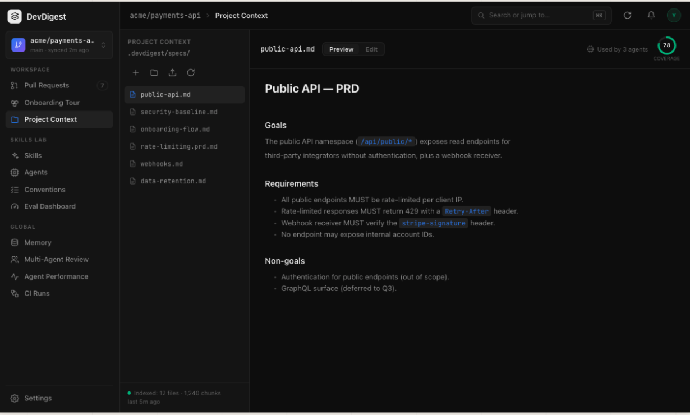
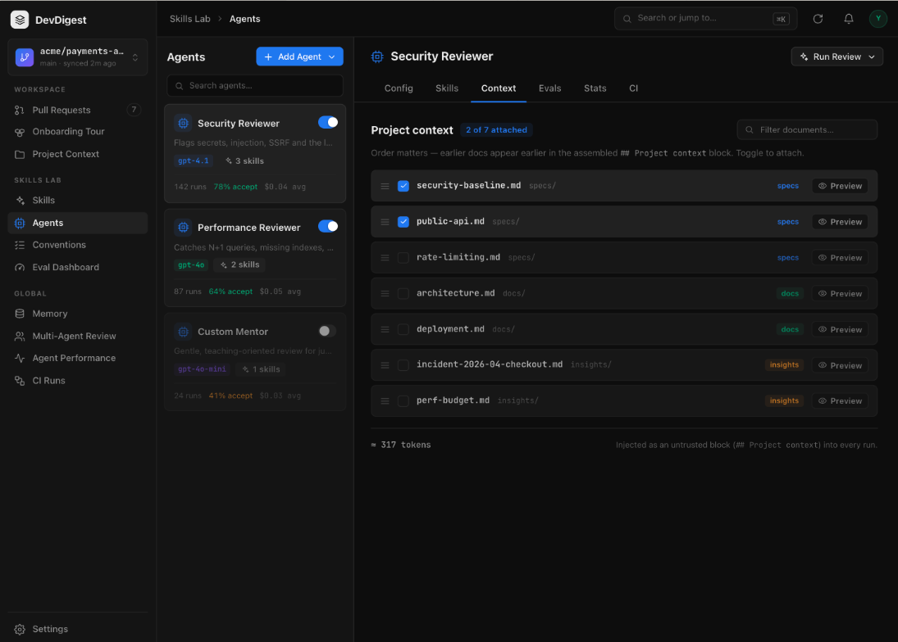
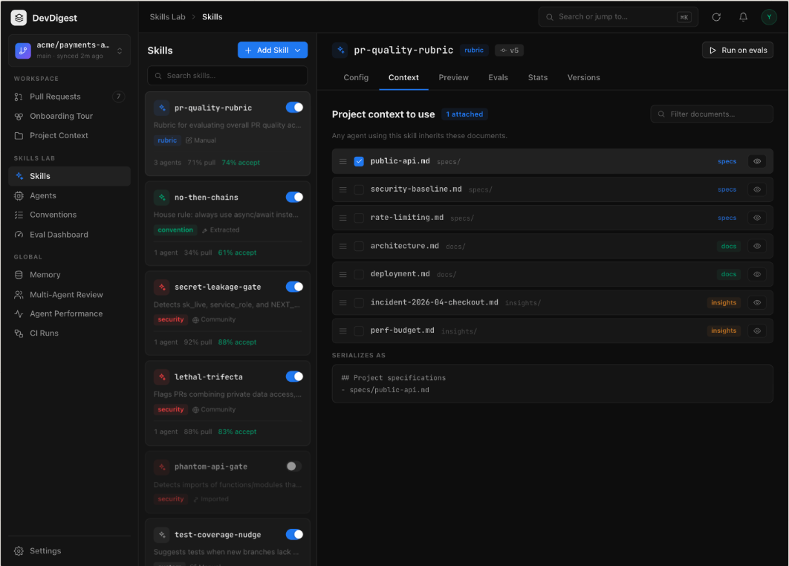
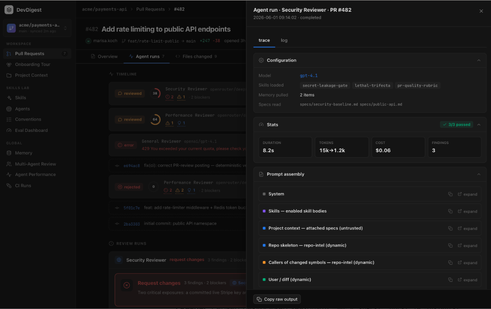

# Spec: Project Context   |   Spec ID: SPEC-01   |   Status: implemented
Supersedes: n/a

## Problem and why

Reviewer agents only see the diff and generic repo signals. The team's own specs (PRDs, security baselines, architecture notes, incident write-ups) live in the repository but never reach the agent, so reviews miss project-specific requirements. Users need to find these Markdown documents, choose which ones each agent or skill should always read, see what that costs in tokens, and later verify exactly what text was added to a run's prompt.

Terms (proposed for `CONTEXT.md`, to be added by `doc-writer`):
- **Context Document**: a `.md` file under `.devdigest/specs/`, `.devdigest/docs/` or `.devdigest/insights/` of a connected repo. Its type (`specs | docs | insights`) is the folder it lives in.
- **Attachment**: a per-repo link from an Agent or a Skill to a Context Document, carrying an `order` unique within that agent's (or skill's) set.
- **Project context block**: the `## Project context` section of the assembled prompt, built from the effective set of attached Context Documents.

## Goals / Non-goals

Goals:
- List and browse all Context Documents of a repo (Project Context page) with Preview/Edit.
- Attach, detach and order Context Documents on an Agent (Context tab) and on a Skill (Context tab).
- Show an approximate token count per document and per attached set, before any run.
- At run start, read attached documents fresh and inject their text as an untrusted block.
- Show, in the run trace, an explicit section with the full injected text.

Non-goals:
- Scanning any Markdown outside the three `.devdigest/` folders (root README, root `docs/`): not supported in this version.
- Coverage ring (score "78" in the design): meaning undefined; deferred to a separate decision.
- Rename of documents (delete with confirmation is in scope; rename is not).
- Truncating or dropping documents silently when they are large: the system only warns.
- RAG/chunk-based injection: injection uses whole files, not indexed chunks. The index (chunks, "Indexed: N files") stays a separate concern.
- LLM quarantine step (ADR-0002) for these files: not required, see Untrusted inputs.
- Pinning attachments to document versions (see Edge cases, known gap).
- Token-usage statistics of a run (the "15k to 1.2k" stat in the trace design).
- Workspace-wide (cross-repo) attachments.

## User stories

- As a reviewer-config owner, I want to see every spec and doc in my repo so I can decide which guide reviews.
- As an owner, I want to attach documents to an agent and order them so the agent reads the most important first.
- As an owner, I want to attach documents to a skill so every agent using it inherits them.
- As an owner, I want to see approximate token cost so I can keep prompts affordable.
- As a reviewer of a run, I want to open the run trace and read the exact project context text sent to the model.

## Design

Mockups (paths relative to this file). Elements marked out of scope are in Non-goals.

1. Project Context page — AC-1…AC-11 (coverage ring "78" out of scope):
   
2. Agent → Context tab — AC-12…AC-24:
   
3. Skill → Context tab (incl. "Serializes as" preview) — AC-12…AC-20:
   
4. Agent run trace, Prompt assembly — AC-32…AC-36 (tokens "15k→1.2k" stat out of scope):
   

## Acceptance criteria (EARS)

Discovery and page
- AC-1: WHEN the user opens Project Context for a repo, the system shall list every `.md` file under `.devdigest/specs/`, `.devdigest/docs/` and `.devdigest/insights/` of that repo's clone, each with its type and size.
- AC-2: The system shall ignore files outside those three folders and files that are not `.md`.
- AC-3: WHEN the user selects a document, the system shall show its rendered content in Preview and its raw text in Edit.
- AC-4: WHEN the user saves an edit, the system shall persist it to the file in the repo clone and show the updated token count.
- AC-5: WHEN the user creates a new document via the add action, the system shall create an empty `.md` file in the chosen allowed folder.
- AC-6: WHEN the user uploads a file, the system shall accept only `.md` files and reject others with an explanatory message.
- AC-7: WHEN the user confirms deletion of a document, the system shall delete the file and remove all Attachments pointing to it.
- AC-8: WHEN the user triggers refresh, the system shall re-read the document list and index status.
- AC-9: WHILE a document is attached to one or more enabled agents, the page shall show "Used by N agents" where N counts distinct enabled agents (directly or through an enabled skill).
- AC-10: IF the repo has no clone or no `.devdigest/` folders, THEN the system shall show the empty state with instructions instead of an error.
- AC-11: IF listing or loading a document fails, THEN the system shall show an error state with retry, without losing unsaved edits.

Attachments
- AC-12: WHEN the user opens an Agent's or Skill's Context tab, the system shall show all Context Documents of the current repo, grouped/badged by type, with attached ones checked, ordered by `order`, plus "N of M attached".
- AC-13: WHEN the user toggles a document, the system shall create or remove the Attachment for that agent or skill.
- AC-14: WHEN the user reorders attached documents by drag, the system shall update `order` and persist it.
- AC-15: The system shall offer a keyboard alternative for reordering (move up / move down) and announce the new position to assistive technology.
- AC-16: WHEN the user types in the filter, the system shall narrow the visible documents by name without changing attachments.
- AC-17: WHEN the user clicks Preview on a document in the tab, the system shall show its content read-only without leaving the tab.
- AC-18: WHILE a tab has no Context Documents in the repo, the system shall show an empty state linking to Project Context.
- AC-19: IF an Attachment points to a file that no longer exists, THEN the system shall show it as "missing", warn the user, and not inject it into any prompt.
- AC-20: The Skill Context tab shall show a preview of the serialized block that agents using the skill inherit.

Tokens
- AC-21: The system shall show for each document an approximate token count computed as `ceil(characters / 4)` from its current content, with no LLM call.
- AC-22: The system shall show for an attached set "≈ N tokens", where N includes the block heading and delimiters, updated on every toggle, reorder or edit.
- AC-23: IF the effective set exceeds 8,000 approximate tokens, THEN the system shall show a warning and shall still allow the run and injection in full.
- AC-24: IF a document exceeds 100 KB, THEN the system shall refuse to attach it and explain the limit.

Run-time injection
- AC-25: WHEN an agent run starts, the system shall read the effective set from the repo's base branch files at that moment (not from the index and not from the PR head).
- AC-26: The effective set shall be the agent's own Attachments in `order`, followed by Attachments of each of its enabled skills in skill order, with duplicates removed (first occurrence wins).
- AC-27: WHILE a skill is disabled, the system shall not add that skill's Attachments.
- AC-28: WHEN the effective set is non-empty, the system shall add the Project context block as untrusted delimited data (never instructions), including each document's path.
- AC-29: WHEN the effective set is empty, the system shall omit the `## Project context` section entirely.
- AC-30: WHEN a run starts, the system shall snapshot document contents once so edits made during the run do not change that run's input.
- AC-31: IF an attached document is missing at run start, THEN the system shall skip it, continue the run, and record it as skipped in the trace.

Trace
- AC-32: WHEN the user opens a run's trace, the Prompt assembly shall contain a section titled "Project context — attached specs (untrusted)" whenever the block was injected.
- AC-33: WHEN the user expands that section, the system shall show the full injected text in injection order, with a copy action.
- AC-34: The trace Configuration shall list the paths in "Specs read" and the origin of each (agent or skill name).
- AC-35: The trace shall store the injected text and paths as a snapshot so viewing an old run is unaffected by later edits or deletions.
- AC-36: WHERE a document was skipped or missing, the trace shall list it with the reason.

## Edge cases

- Same document attached directly and via several skills: injected once, at its first position (AC-26).
- Agent shared across repos: only Attachments of the current repo apply; other repos' Attachments are ignored (per-repo scope).
- Concurrent edit by two tabs: last save wins; the saving user is warned if the file changed since load.
- Path traversal, symlinks pointing outside the three folders, and non-`.md` names are refused for read, write, upload and delete.
- Empty document: attachable, 0 tokens, injected as empty entry (path only).
- Known gap: like skill version pinning in `CONTEXT.md`, `agent_versions` snapshots store document ids only, not content versions. Trace snapshots (AC-35) cover past-run viewing; replay is an eval concern not built yet.

## Non-functional

- Security: see Untrusted inputs. All file operations are confined to the three folders of the repo clone.
- Performance: listing and token counts for up to 200 documents shall render in under 1 s on a local repo; token counts are computed without network calls.
- Accessibility: all actions (attach, reorder, preview, delete) are keyboard-operable; state changes are announced; UI strings go through i18n.
- Determinism: same effective set and same file contents shall produce byte-identical Project context block.

## Inputs (provenance)

- Document list, content, size: [deterministic: repo clone filesystem, `.devdigest/*`]
- Token estimate: [deterministic: characters / 4]
- Attachments and order: [deterministic: user configuration in DB]
- Skill and agent enablement: [reused: Skills/Agents features, AgentSkill]
- Prompt injection point: [reused: existing `specs` part and `## Project context` section in prompt assembly]
- Trace section and specs read: [reused: run trace, prompt assembly view]
- LLM cost: [new: 0 LLM calls]; cost is only the added prompt tokens shown in AC-22.

## Untrusted inputs

Context Documents are foreign text (any contributor can edit them via the repo). The system shall treat them as data to consider, never as commands: they are delimiter-wrapped and covered by the injection guard, consistent with ADR-0001 and the existing `specs` handling; they never gain trusted or directive status. Files are read from the base branch, not the PR head, so a PR author cannot change what the agent reads for their own PR. No separate LLM quarantine step (ADR-0002) is applied because these are files of a repo the user connected, not arbitrary fetched URLs; escalating this would need its own ADR. Trace display renders content as text, not executable markup.

## [NEEDS CLARIFICATION: …]

None blocking. Confirm at approval: the 100 KB per-document limit (AC-24) and 200-document performance target are proposed values.
